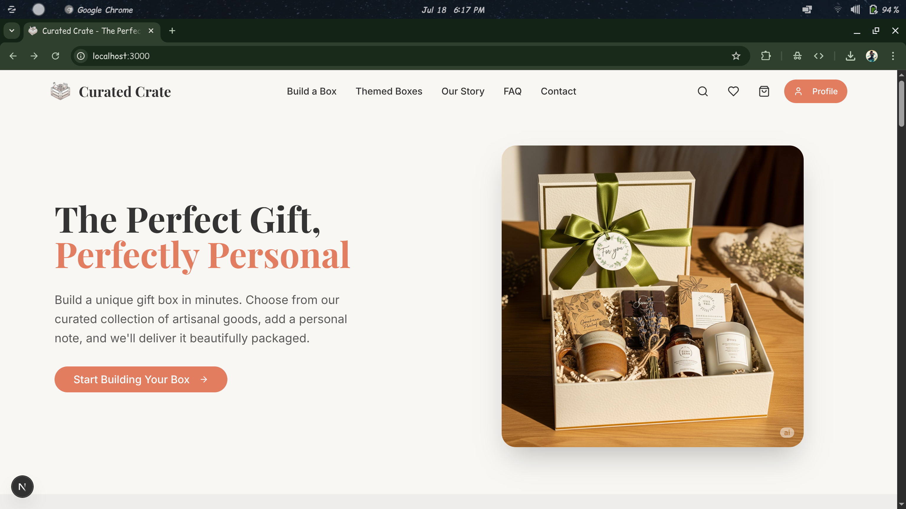

# Curated Crate

Curated Crate is a modern e-commerce platform for creating and purchasing personalized gift boxes. It allows users to select from a variety of artisanal products to build their own unique "crate" or choose from pre-designed themed boxes. The platform is built with a focus on a clean, user-friendly interface and a robust backend to handle products, orders, and user accounts.

## Live Demo

- **Website:** [https://curated-crate.vercel.app](https://curated-crate.vercel.app)
- **Admin Panel:** [https://curated-crate.vercel.app/admin/login](https://curated-crate.vercel.app/admin/login)

## Demo Credentials

- **Admin:**
  - **Email:** `admin@gmail.in`
  - **Password:** `admin@123`
- **User:**
  - **Email:** `user@gmail.com`
  - **Password:** `user1234`

## Demo Image :

### user :



**Homepage:**

**Admin Dashboard:**

## Features

- **Customer-Facing:**
  - User authentication (Sign up, Login)
  - Browse and filter products
  - View themed gift boxes
  - Add items to a shopping cart
  - Checkout and payment processing (mocked)
  - Manage user account (profile, addresses, order history)
  - Product and themed box reviews

- **Admin Panel:**
  - Admin uthentication (Login)
  - Dashboard with sales and user statistics
  - Order management
  - Product and themed box creation and management
  - Customer management
  - Analytics and reporting
  - Coupouns Creation

## Tech Stack

- **Framework:** [Next.js](https://nextjs.org/)
- **Language:** [TypeScript](https://www.typescriptlang.org/)
- **Styling:** [Tailwind CSS](https://tailwindcss.com/) with [shadcn/ui](https://ui.shadcn.com/) components
- **Database:** [MongoDB](https://www.mongodb.com/) with [Mongoose](https://mongoosejs.com/)
- **Authentication:** [NextAuth.js](https://next-auth.js.org/)
- **Animations:** [Framer Motion](https://www.framer.com/motion/)

## Getting Started

Follow these instructions to get a copy of the project up and running on your local machine for development and testing purposes.

### Prerequisites

- Node.js (v18 or later)
- pnpm (or npm/yarn)
- MongoDB instance (local or cloud-based)

### Installation

1.  **Clone the repository:**

    ```bash
    git clone https://github.com/your-username/curated-crate.git
    cd curated-crate
    ```

2.  **Install dependencies:**

    ```bash
    pnpm install
    ```

3.  **Set up environment variables:**

    Create a `.env.local` file in the root of your project and add the following variables:

    ```env
    NEXTAUTH_SECRET=your-secret-key-here
    MONGODB_URL=your-mongodb-connection-string
    NEXT_PUBLIC_CLOUDINARY_CLOUD_NAME=your-cloudinary-cloud-name
    NEXT_PUBLIC_CLOUDINARY_UPLOAD_PRESET=your-cloudinary-upload-preset
    RESEND_API_KEY=your-resend-api-key
    EMAIL=your-email-address
    ```

4.  **Run the development server:**

    ```bash
    pnpm run dev
    ```

    The application should now be running at [http://localhost:3000](https://www.google.com/search?q=http://localhost:3000).

## Project Structure

The project follows the standard Next.js App Router structure.

```
/src
├── app/                  # Main application routes
│   ├── (admin)/          # Admin-only routes
│   ├── (user)/           # User-specific routes
│   ├── api/              # API endpoints
│   └── ...
├── backend/              # Backend logic
│   ├── lib/              # Database connection, auth helpers
│   └── models/           # Mongoose schemas
├── components/           # Reusable React components
│   ├── Landing/          # Components for the landing page
│   ├── Layout/           # Layout components (Navbar, Footer)
│   └── ui/               # shadcn/ui components
├── contexts/             # React Context providers (e.g., StoreContext)
└── hooks/                # Custom React hooks
```

## Available Scripts

- `pnpm dev`: Runs the application in development mode.
- `pnpm build`: Builds the application for production.
- `pnpm start`: Starts the production server.
- `pnpm lint`: Lints the code using Next.js's built-in ESLint configuration.
